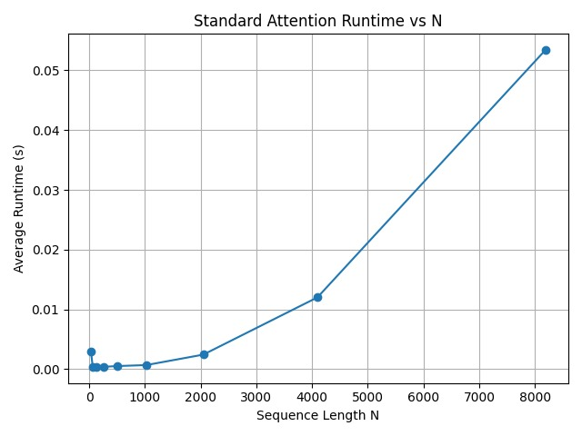

# Flash Attention

Implementation and benchmarking of Flash Attention v1 from scratch using PyTorch CUDA tensors, with a standard scaled dot-product attention baseline for correctness and performance comparison.

## Goal

Reproduce the core result of the [FlashAttention v1 paper (Dao et al., 2022)](https://arxiv.org/abs/2205.14135): show that a tiled, IO-aware attention kernel can match standard attention in correctness while being significantly faster and more memory-efficient at long sequence lengths.

## Structure

| File | Description |
|------|-------------|
| `Standard-attention.py` | Baseline standard attention — computes the full N×N attention matrix explicitly |
| `Flash-attention.py` | Flash Attention v1 implementation _(in progress)_ |

## Standard Attention Baseline

Implements scaled dot-product attention:

$$O = \text{softmax}\left(\frac{QK^T}{\sqrt{D}}\right)V$$

- Uses `torch.matmul` and `torch.softmax` with `dim=-1`
- Forms the full N×N attention matrix explicitly (no tiling or block loops)
- Runs on `float16` tensors on CUDA
- Benchmarks average runtime over 10 iterations across sequence lengths N ∈ {32, 64, 128, 256, 512, 1024, 2048, 4096, 8192}

### Runtime vs Sequence Length



Runtime grows quadratically with N — the core bottleneck Flash Attention v1 addresses through tiled block computation and HBM-aware memory access.

## Flash Attention v1

Flash Attention v1 avoids materializing the full N×N attention matrix by computing attention in tiles that fit in SRAM. Key ideas:

- **Tiling** — split Q, K, V into blocks; process one block at a time
- **Online softmax** — maintain running max and normalization factor to compute numerically stable softmax without a second pass
- **IO complexity** — reduces HBM reads/writes from O(N²) to O(N²/M) where M is SRAM size

## Benchmark Settings

| Parameter | Value |
|-----------|-------|
| Batch size B | 8 |
| Number of heads N_H | 16 |
| Head dimension D | 64 |
| dtype | float16 |
| Device | CUDA |
| Iterations | 10 |
| Sequence lengths N | 32 → 8192 (powers of 2) |

## Requirements

```
torch
matplotlib
```
